# Tutorial Follow along steps
Available at: https://docs.aws.amazon.com/powertools/python/latest/tutorial/#requirements

## Initialize project from template using SAM tool

sam init --runtime python3.13 --dependency-manager pip --app-template hello-world --name powertools-quickstart

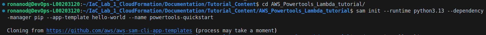

This results in the following project structure: 

```
`-- powertools-quickstart
    |-- events
    |   `-- event.json
    |-- hello_world
    |   |-- app.py
    |   |-- __init__.py
    |   `-- requirements.txt
    |-- __init__.py
    |-- README.md
    |-- samconfig.toml
    |-- template.yaml
    `-- tests
        |-- __init__.py
        |-- integration
        |   |-- __init__.py
        |   `-- test_api_gateway.py
        |-- requirements.txt
        `-- unit
            |-- __init__.py
            `-- test_handler.py
```

## Files in focus:

app.py - Application code.

template.yaml - AWS infrastructure configuration using SAM.

requirements.txt - List of extra Python packages needed.

## Modify app.py:
``` python
import json


def hello():
    return {"statusCode": 200, "body": json.dumps({"message": "hello unknown!"})}


def lambda_handler(event, context):
    return hello()

```

## Modify template.yaml

``` yaml
AWSTemplateFormatVersion: '2010-09-09'
Transform: AWS::Serverless-2016-10-31
Description: Sample SAM Template for powertools-quickstart
Globals:
    Function:
        Timeout: 3
Resources:
    HelloWorldFunction:
        Type: AWS::Serverless::Function
        Properties:
            CodeUri: hello_world/
            Handler: app.lambda_handler
            Runtime: python3.13
            Architectures:
                - x86_64
            Events:
                HelloWorld:
                    Type: Api
                    Properties:
                        Path: /hello
                        Method: get
Outputs:
    HelloWorldApi:
        Description: "API Gateway endpoint URL for Prod stage for Hello World function"
        Value: !Sub "https://${ServerlessRestApi}.execute-api.${AWS::Region}.amazonaws.com/Prod/hello/" 
```

## Run Code locally using SAM: 

Without a container you are required to have the python 3.13 on your path; I didn't so I went with a container solution. 

``` bash
sam build && sam local start-api
```

## Run using a docker container: 

``` bash
sam build --use-container && sam local start-api
```

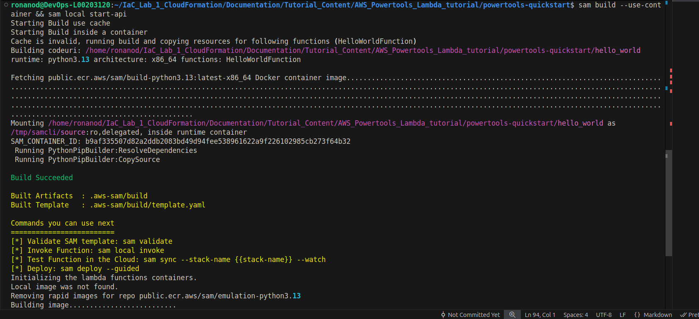

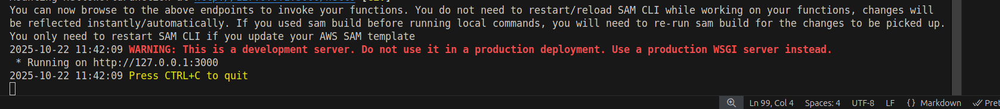

## Invoke function: 

``` bash 
curl http://127.0.0.1:3000/hello 
```

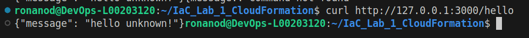

## Test live deployment

``` bash
sam deploy --guided
```

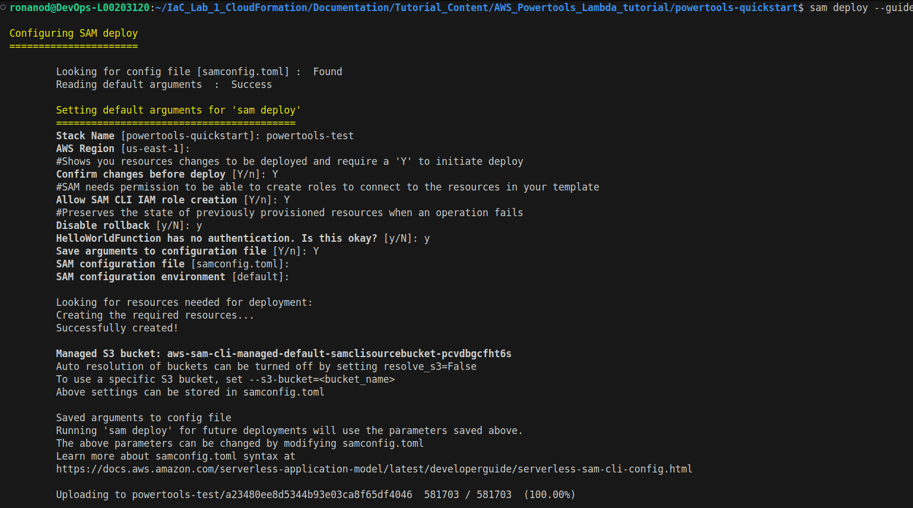

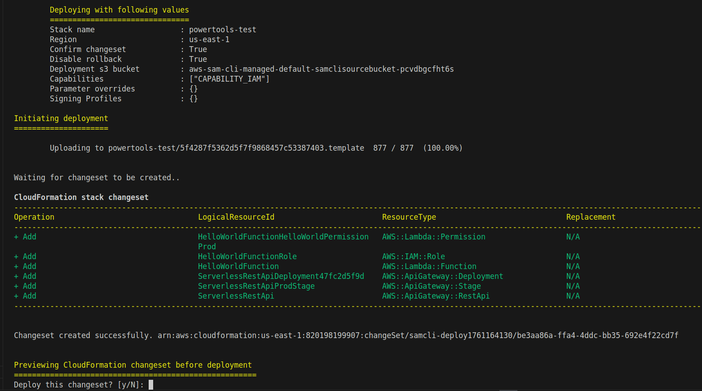

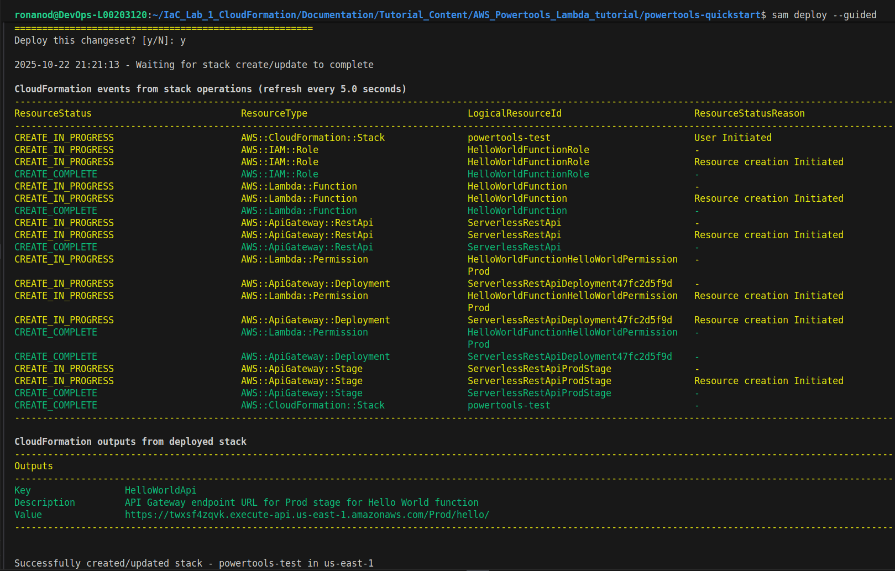

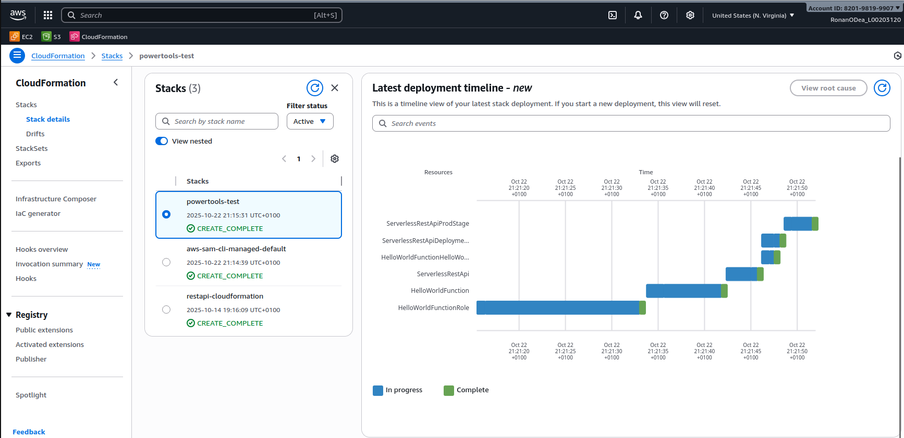

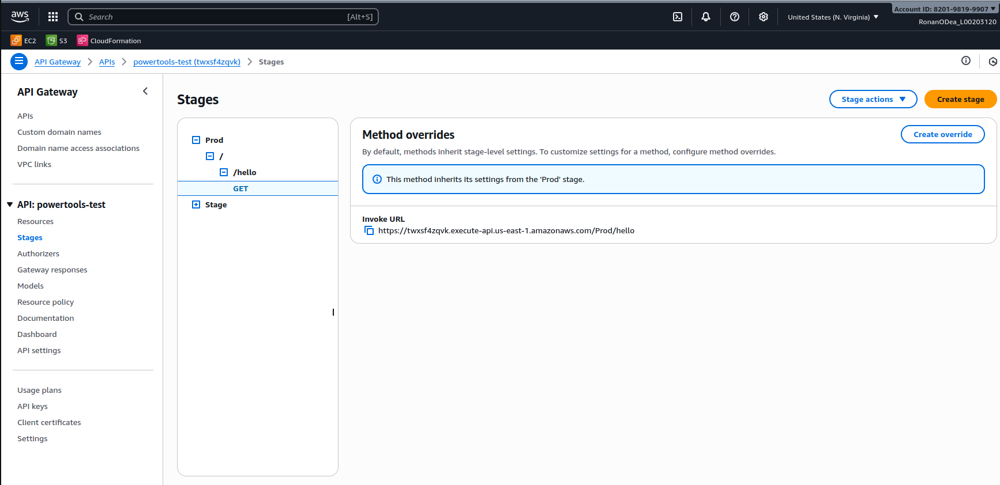

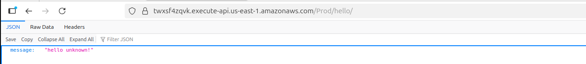

## Incorporate Powertools tracer for route handling

app.py:

``` python
from aws_lambda_powertools.event_handler import APIGatewayRestResolver

app = APIGatewayRestResolver()


@app.get("/hello/<name>")
def hello_name(name):
    return {"message": f"hello {name}!"}


@app.get("/hello")
def hello():
    return {"message": "hello unknown!"}


def lambda_handler(event, context):
    return app.resolve(event, context)
```

requirements.txt:

``` txt
aws-lambda-powertools[tracer]  # Tracer requires AWS X-Ray SDK dependency

```

template.yaml

``` yaml
AWSTemplateFormatVersion: "2010-09-09"
Transform: AWS::Serverless-2016-10-31
Description: Sample SAM Template for powertools-quickstart

Globals:
  Function:
    Timeout: 3 
Resources:
  HelloWorldFunction:
    Type: AWS::Serverless::Function
    Properties:
      CodeUri: hello_world/ 
      Handler: app.lambda_handler 
      Runtime: python3.13 
      Architectures: 
        - x86_64
      Events:
        # Endpoint for GET /hello
        HelloWorldRoot:
          Type: Api
          Properties:
            Path: /hello
            Method: get
        # Endpoint for GET /hello/{name}
        HelloWorldName:
          Type: Api
          Properties:
            Path: /hello/{name} # Added path parameter
            Method: get

Outputs:
  HelloWorldApi:
    Description: "API Gateway endpoint URL for Prod stage for Hello World function (/hello)"
    
    Value: !Sub "https://${ServerlessRestApi}.execute-api.${AWS::Region}.amazonaws.com/Prod/hello/"

  # Added an output for the new endpoint
  HelloWorldNameApi:
    Description: "API Gateway endpoint URL for Prod stage for Hello World function (/hello/{name})"
    Value: !Sub "https://${ServerlessRestApi}.execute-api.${AWS::Region}.amazonaws.com/Prod/hello/{name}"
```


Build this locally:

``` bash
sam build --use-container && sam local start-api

```
Test locally: 
```bash
curl 'http://127.0.0.1:3000/hello/Ronan'
```

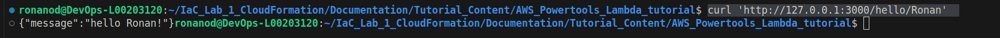

## Deploy and test live: 

```bash
sam deploy --guided
``` 
Same process as before; note the addition of an extra output to the template.yaml allows one to use the output value/invocation for testing from the terminal as per below: 

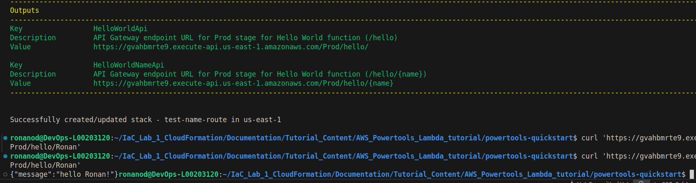

# Add logging function via powertools logger:

****app.py:**


``` python
from aws_lambda_powertools import Logger
from aws_lambda_powertools.event_handler import APIGatewayRestResolver
from aws_lambda_powertools.logging import correlation_paths

logger = Logger(service="APP")

app = APIGatewayRestResolver()


@app.get("/hello/<name>")
def hello_name(name):
    logger.info(f"Request from {name} received")
    return {"message": f"hello {name}!"}


@app.get("/hello")
def hello():
    logger.info("Request from unknown received")
    return {"message": "hello unknown!"}


@logger.inject_lambda_context(correlation_id_path=correlation_paths.API_GATEWAY_REST, log_event=True)
def lambda_handler(event, context):
    return app.resolve(event, context)

```

While logs are output to terminal, for readability Cloudwatch is preferable; so deploy live, invoke to generate logs and you can view them in the AWS console interface online. Below a JSON format log generated by running the hello_world lambda function is shown via the CLoudwatch interface. 

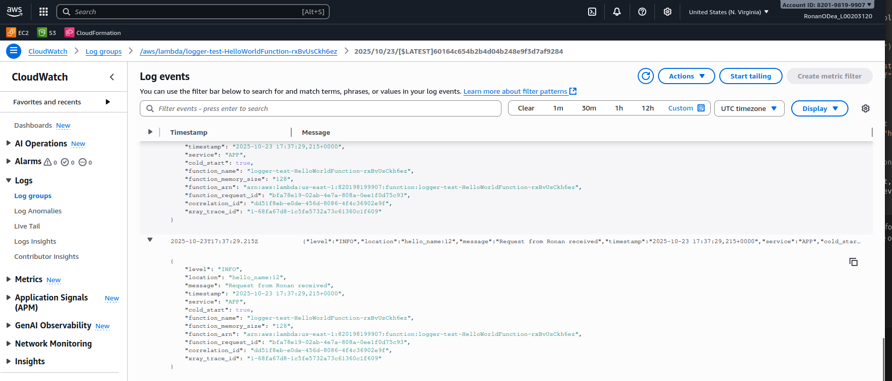

A learning opportunity arose when the author investigated the Log Insight interface and could not retrieve any logs related to the ./logger-test-HelloWorldFunction; adjusting time range, time zone and multiple queries did not return any logs despite being selectable as a group - which led back to the code. 

``` toml
[default.global.parameters]
stack_name = "powertools-quickstart"  # This line caused conflict and was subsequently commented out
region = "us-east-1"
```
In the above a global stack_name was defined in the samconfig.toml file - while when sam deploy was invoked a different stack name was provided - leading to a routing error for the logs; they weren't available in the "Log insights" tab. 

The solution was as follows: 

- Delete 
- Rebuild without the global stack_name definition in samconfig.toml
- Deploy

```bash
sam delete --stack-name logger-test --region us-east-1
```

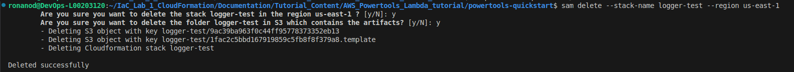

``` bash
sam build --use-container
```
``` bash
sam deploy
```

Once deployed rather than using the interface to test the API endpoints you can retrieve the required information for invocation directly form the terminal using: 

```bash 
aws cloudformation describe-stacks \
  --stack-name logger-test \
  --query 'Stacks[0].Outputs' \
  --region us-east-1
```

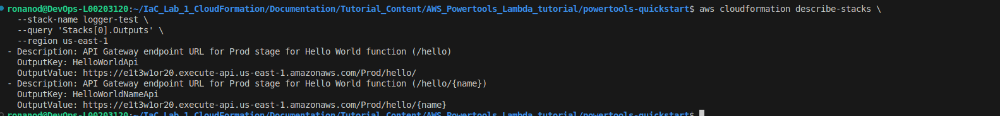

Using the curl command you can then invoke the lambda function directly - which should then be viewable in the log insights window: 

``` bash
# With name parameter
curl https://e1t3w1or20.execute-api.us-east-1.amazonaws.com/Prod/hello/Ronan

# Without name parameter
curl https://e1t3w1or20.execute-api.us-east-1.amazonaws.com/Prod/hello
```

For Example: 

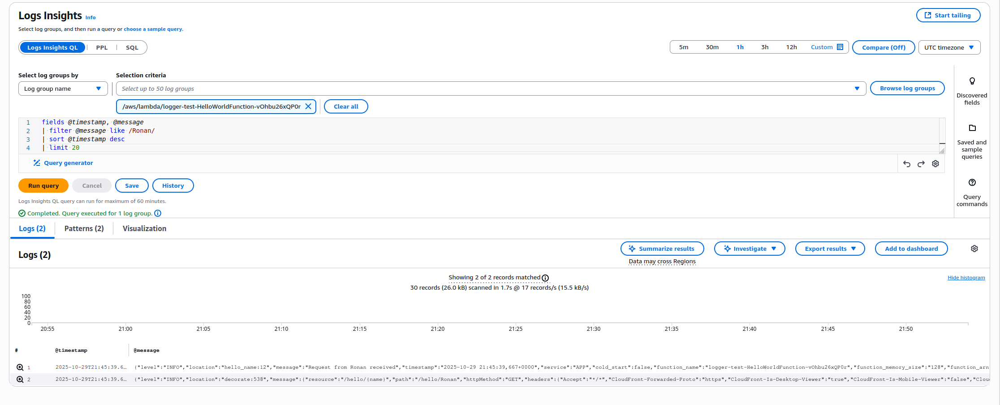


# Adding Distributed Tracing Service AWS X-Ray via Powertools tracer wrapper:

While the previously implemented logging functionality is useful for monitoring; error reports and more; next to be integrated is a tracing function which allows for tracing the path of a sent request as it traverses the deployed services giving the ability to monitor and trace end-to-end requests for debugging etc. 

Powertools provides a lightweight wrapper for AWS X-Ray services named Tracer

### template.yaml

``` yaml
AWSTemplateFormatVersion: "2010-09-09"
Transform: AWS::Serverless-2016-10-31
Description: Sample SAM Template for powertools-quickstart

Globals:
  Function:
    Timeout: 3 
  #_____________________________________________________________________________________
  # Addition of Tracing added here  
  Api:
    TracingEnabled: true
Resources:
  HelloWorldFunction:
    Type: AWS::Serverless::Function
    Properties:
      CodeUri: hello_world/ 
      Handler: app.lambda_handler 
      Runtime: python3.13
      # Activation within the function added here 
      Tracing: Active
    #______________________________________________________________________________________
      Architectures: 
        - x86_64
      Events:
   
        HelloWorldRoot:
          Type: Api
          Properties:
            Path: /hello
            Method: get
    
        HelloWorldName:
          Type: Api
          Properties:
            Path: /hello/{name} 
            Method: get

Outputs:
  HelloWorldApi:
    Description: "API Gateway endpoint URL for Prod stage for Hello World function (/hello)"
    
    Value: !Sub "https://${ServerlessRestApi}.execute-api.${AWS::Region}.amazonaws.com/Prod/hello/"

  HelloWorldNameApi:
    Description: "API Gateway endpoint URL for Prod stage for Hello World function (/hello/{name})"
    Value: !Sub "https://${ServerlessRestApi}.execute-api.${AWS::Region}.amazonaws.com/Prod/hello/{name}"
```

### app.py

``` python
from aws_lambda_powertools import Logger, Tracer
from aws_lambda_powertools.event_handler import APIGatewayRestResolver
from aws_lambda_powertools.logging import correlation_paths

logger = Logger(service="APP")
# Initialize tracer, define service name
tracer = Tracer(service="APP")
app = APIGatewayRestResolver()


@app.get("/hello/<name>")
# @tracer.capture_method decorator
@tracer.capture_method
def hello_name(name):
    logger.info(f"Request from {name} received")
    return {"message": f"hello {name}!"}


@app.get("/hello")
# @tracer.capture_method decorator
@tracer.capture_method
def hello():
# tracer annotation to use value unknown during trace of /hello route
    tracer.put_annotation(key="User", value="unknown")
    logger.info("Request from unknown received")
    return {"message": "hello unknown!"}


@logger.inject_lambda_context(correlation_id_path=correlation_paths.API_GATEWAY_REST, log_event=True)
# Adds ColdStart annotation within Tracer itself. 
# Also add a new Service annotation using the value of Tracer(service="APP") - easy filtering
@tracer.capture_lambda_handler
def lambda_handler(event, context):
    return app.resolve(event, context)

```
### requirements.txt
``` txt
aws-lambda-powertools
aws-xray-sdk
```

## Viewing on X-Ray interface:
After implementing the above: rebuild, deploy and invoke before investigating via the X-Ray interface. 

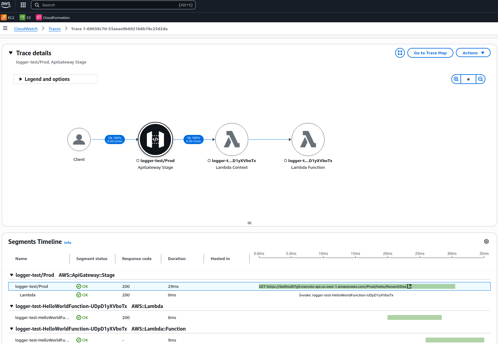


# Adding Custom Metrics: 

The last addition to this tutorial demonstrates the addition of custom metrics to our current code. 

### template.yaml

``` yaml
AWSTemplateFormatVersion: "2010-09-09"
Transform: AWS::Serverless-2016-10-31
Description: Sample SAM Template for powertools-quickstart

Globals:
  Function:
    Timeout: 3 
  Api:
    TracingEnabled: true
Resources:
  HelloWorldFunction:
    Type: AWS::Serverless::Function
    Properties:
      CodeUri: hello_world/ 
      Handler: app.lambda_handler 
      Runtime: python3.13 
      Tracing: Active
      Architectures: 
        - x86_64
      Events:
        # Endpoint for GET /hello
        HelloWorldRoot:
          Type: Api
          Properties:
            Path: /hello
            Method: get
        # Endpoint for GET /hello/{name}
        HelloWorldName:
          Type: Api
          Properties:
            Path: /hello/{name} 
            Method: get
# ___________________________________________________________________________________________________
      # This Policy update allows for a synchronous call to CloudWatch Metrics API. This means 
      # establishing a connection to CloudWatch endpoint, sending metrics payload, and waiting for a 
      # response - potential for additional cost and latency
      Policies:
        - CloudWatchPutMetricPolicy: {}
# ___________________________________________________________________________________________________

Outputs:
  HelloWorldApi:
    Description: "API Gateway endpoint URL for Prod stage for Hello World function (/hello)"
    
    Value: !Sub "https://${ServerlessRestApi}.execute-api.${AWS::Region}.amazonaws.com/Prod/hello/"

  # Added an output for the new endpoint
  HelloWorldNameApi:
    Description: "API Gateway endpoint URL for Prod stage for Hello World function (/hello/{name})"
    Value: !Sub "https://${ServerlessRestApi}.execute-api.${AWS::Region}.amazonaws.com/Prod/hello/{name}"

```


### app.py

```python
from aws_lambda_powertools import Logger, Tracer, Metrics
from aws_lambda_powertools.event_handler import APIGatewayRestResolver
from aws_lambda_powertools.logging import correlation_paths
from aws_lambda_powertools.metrics import MetricUnit

logger = Logger(service="APP")
# Initialize tracer, define service name
tracer = Tracer(service="APP")
# initialize Metrics with our service name (APP) and metrics namespace (MyApp),
metrics = Metrics(namespace="MyApp", service="APP")
app = APIGatewayRestResolver()


@app.get("/hello/<name>")
# @tracer.capture_method decorator
@tracer.capture_method
def hello_name(name):
    logger.info(f"Request from {name} received")
    # Sends a data point with value 1 to CloudWatch - CloudWatch aggregates
    metrics.add_metric(name="SuccessfulGreetings", unit=MetricUnit.Count, value=1)
    return {"message": f"hello {name}!"}


@app.get("/hello")
# @tracer.capture_method decorator
@tracer.capture_method
def hello():
# tracer annotation to use value unknown during trace of /hello route
    tracer.put_annotation(key="User", value="unknown")
    logger.info("Request from unknown received")
    # Sends a data point with value 1 to CloudWatch - CloudWatch aggregates
    metrics.add_metric(name="SuccessfulGreetings", unit=MetricUnit.Count, value=1)
    return {"message": "hello unknown!"}


@tracer.capture_lambda_handler
@logger.inject_lambda_context(correlation_id_path=correlation_paths.API_GATEWAY_REST, log_event=True)
@metrics.log_metrics(capture_cold_start_metric=True)
def lambda_handler(event, context):
    try:
        return app.resolve(event, context)
    except Exception as e:
        logger.exception(e)
        raise
```

With these additions - build and redeploy and send multiple requests to build up a count for our custom  metric; which can then be viewed in metrics on X-Ray: 

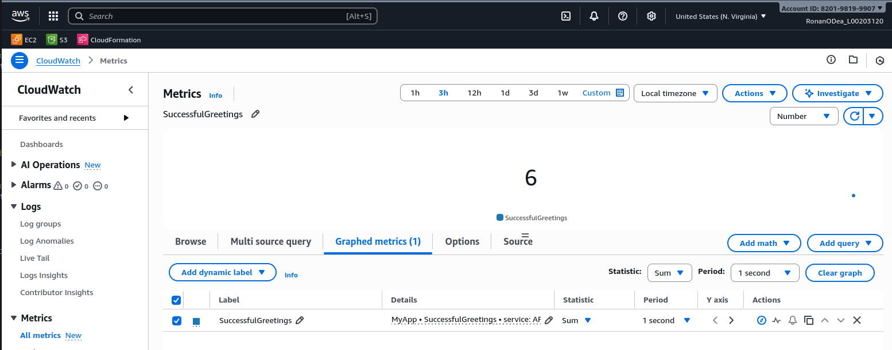