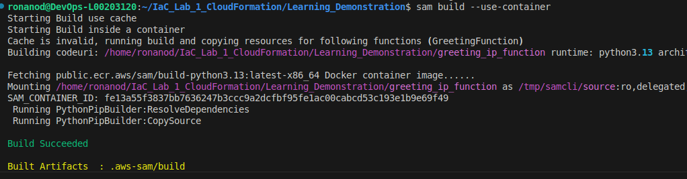

# 1. Directory Structure

Using the terminal created: 

``` bash
Learning_Demonstration
├── greeting_ip_function
│   ├── app.py
│   └── requirements.txt
├── samconfig.toml
├── Steps_Taken.md
└── template.yaml

```

# 2. Integration of AWS Powertools Tutorial 

Modified to have a different naming convention for URL routing, python lambda function etc. 

### template.yaml

``` yaml
AWSTemplateFormatVersion: "2010-09-09"
Transform: AWS::Serverless-2016-10-31
Description: Learning Demonstration using powertools


Globals:
  Function:
    Timeout: 3 
  Api:
    TracingEnabled: true


Resources:
  GreetingFunction:
    Type: AWS::Serverless::Function
    Properties:
      CodeUri: greeting_ip_function/ 
      Handler: app.lambda_handler 
      Runtime: python3.13 
      Tracing: Active
      Architectures: 
        - x86_64
      Events:
        # Endpoint for GET /greeting
        GreetingNoName:
          Type: Api
          Properties:
            Path: /greeting
            Method: get
        # Endpoint for GET /greeting/{name}
        GreetingWithName:
          Type: Api
          Properties:
            Path: /greeting/{name} 
            Method: get
      Policies:
        - CloudWatchPutMetricPolicy: {}

Outputs:
  GreetingApi:
    Description: "API Gateway endpoint URL for Prod stage for greeting_ip_function (/greeting)"
    
    Value: !Sub "https://${ServerlessRestApi}.execute-api.${AWS::Region}.amazonaws.com/Prod/greeting/"

  # Added an output for the new endpoint
  GreetingNameApi:
    Description: "API Gateway endpoint URL for Prod stage for greeting_ip_function (/greeting/{name})"
    Value: !Sub "https://${ServerlessRestApi}.execute-api.${AWS::Region}.amazonaws.com/Prod/greeting/{name}"

```

 ### greeting_ip_function/app.py

 ``` python 
 from aws_lambda_powertools import Logger, Tracer, Metrics
from aws_lambda_powertools.event_handler import APIGatewayRestResolver
from aws_lambda_powertools.logging import correlation_paths
from aws_lambda_powertools.metrics import MetricUnit

logger = Logger(service="APP")
# Initialize tracer, define service name
tracer = Tracer(service="APP")
# initialize Metrics with our service name (APP) and metrics namespace (MyApp),
metrics = Metrics(namespace="MyApp", service="APP")
app = APIGatewayRestResolver()


@app.get("/greeting/<name>")
# @tracer.capture_method decorator
@tracer.capture_method
def greeting_name(name):
    logger.info(f"Request from {name} received")
    # Sends a data point with value 1 to CloudWatch - CloudWatch aggregates
    metrics.add_metric(name="SuccessfulGreetings", unit=MetricUnit.Count, value=1)
    return {"message": f"hello {name}!"}


@app.get("/greeting")
# @tracer.capture_method decorator
@tracer.capture_method
def greeting():
# tracer annotation to use value unknown during trace of /greeting route
    tracer.put_annotation(key="User", value="unknown")
    logger.info("Request from unknown received")
    # Sends a data point with value 1 to CloudWatch - CloudWatch aggregates
    metrics.add_metric(name="SuccessfulGreetings", unit=MetricUnit.Count, value=1)
    return {"message": "hello unknown!"}


@tracer.capture_lambda_handler
@logger.inject_lambda_context(correlation_id_path=correlation_paths.API_GATEWAY_REST, log_event=True)
@metrics.log_metrics(capture_cold_start_metric=True)
def lambda_handler(event, context):
    try:
        return app.resolve(event, context)
    except Exception as e:
        logger.exception(e)
        raise

```

### greetinhg_ip_function/requirements.txt

``` text
aws-lambda-powertools
```

# 3. Build and Test locally

``` bash
sam build --use-container
```



Start the local API:

``` bash
sam local start-api
```


Using a new terminal: 

``` bash
# Test without name
curl http://localhost:3000/greeting

# Test with name  
curl http://localhost:3000/greeting/Ronan
```


# 4. Add IP retrieval functionality 

The rino-dev tutorial accessed the source ip using: 

``` python

          def lambda_handler(event, context):
              ip_address = event['requestContext']['identity']['sourceIp']
              return {
                  'body': json.dumps({"ip_address": ip_address}),
                  'headers': {
                      'Content-Type': 'application/json'
                  },
                  'statusCode': 200
              }

```

However our powertools use means routing is handled by APIGatewayRestResolver.resolve()

```python def lambda_handler(event, context):
    try:
        return app.resolve(event, context)
    except Exception as e:
        logger.exception(e)
        raise
```
So instead we access the event data directly in the routing functions rather than the handler - we use the powertools current_event.raw_event property - https://docs.aws.amazon.com/powertools/python/2.34.1/api/utilities/data_classes/common.html#aws_lambda_powertools.utilities.data_classes.common.DictWrapper.raw_event

``` python
@app.get("/greeting/<name>")
# @tracer.capture_method decorator
@tracer.capture_method
def greeting_name(name):
    # Here we can use powertools to obtain the event data
    event = app.current_event.raw_event
    # Obtain Ip as per initial tutorial 
    source_ip = event['requestContext']['identity']['sourceIp']

    logger.info(f"Request from {name} received from ip: {source_ip}")
    # Sends a data point with value 1 to CloudWatch - CloudWatch aggregates
    metrics.add_metric(name="SuccessfulGreetings", unit=MetricUnit.Count, value=1)
    return {"message": f"hello {name}, your ip is {source_ip}"}
```


### app.py 
``` python
from aws_lambda_powertools import Logger, Tracer, Metrics
from aws_lambda_powertools.event_handler import APIGatewayRestResolver
from aws_lambda_powertools.logging import correlation_paths
from aws_lambda_powertools.metrics import MetricUnit

logger = Logger(service="APP")
# Initialize tracer, define service name
tracer = Tracer(service="APP")
# initialize Metrics with our service name (APP) and metrics namespace (MyApp),
metrics = Metrics(namespace="MyApp", service="APP")
app = APIGatewayRestResolver()


@app.get("/greeting/<name>")
# @tracer.capture_method decorator
@tracer.capture_method
def greeting_name(name):
    # Here we can use powertools to obtain the event data
    event = app.current_event.raw_event
    # Obtain Ip as per initial tutorial 
    source_ip = event['requestContext']['identity']['sourceIp']

    logger.info(f"Request from {name} received from ip: {source_ip}")
    # Sends a data point with value 1 to CloudWatch - CloudWatch aggregates
    metrics.add_metric(name="SuccessfulGreetings", unit=MetricUnit.Count, value=1)
    return {"message": f"hello {name}, your ip is {source_ip}"}


@app.get("/greeting")
# @tracer.capture_method decorator
@tracer.capture_method
def greeting():
     # Here we can use powertools to obtain the event data
    event = app.current_event.raw_event
    # Obtain Ip as per initial tutorial 
    source_ip = event['requestContext']['identity']['sourceIp']
    # tracer annotation to use value unknown during trace of /greeting route
    tracer.put_annotation(key="User", value="unknown")
    logger.info("Request from unknown received")
    # Sends a data point with value 1 to CloudWatch - CloudWatch aggregates
    metrics.add_metric(name="SuccessfulGreetings", unit=MetricUnit.Count, value=1)
    return {"message": f"hello unknown, your ip is {source_ip}"}


@tracer.capture_lambda_handler
@logger.inject_lambda_context(correlation_id_path=correlation_paths.API_GATEWAY_REST, log_event=True)
@metrics.log_metrics(capture_cold_start_metric=True)
def lambda_handler(event, context):
    try:
        return app.resolve(event, context)
    except Exception as e:
        logger.exception(e)
        raise
```

# Build and Test locally: 

Following same method as above we can now see that the source ip address is returned


# Deploy and view log insights, traces and metrics

## Loadtesting/traffic generation

Now that we have verified this code works locally we can deploy to AWS live and evaluate it there; however in order to generate some traffic in an automated fashion and avoid having to repeatedly use curl a load testing script was designed which uses Grafana's K6 Open Source load testing tool. 

### tests/load/loadtest.js

```js
import http from 'k6/http';
import { check } from 'k6';

const names = [
  'Alice', 'Bob', 'Charlie', 'David', 'Emma',
  'Frank', 'Grace', 'Henry', 'Iris', 'Jack',
  'Kate', 'Liam', 'Mia', 'Noah', 'Olivia',
  'Peter', 'Quinn', 'Rachel', 'Sam', 'Tina',
  'Uma', 'Victor', 'Wendy', 'Xavier', 'Yara',
  'Zach', 'Amy', 'Ben', 'Clara', 'Dan',
  'Eve', 'Fred', 'Gina', 'Hank', 'Ivy',
  'Joe', 'Kim', 'Leo', 'Maya', 'Nick',
  'Oscar', 'Pam', 'Ray', 'Sue', 'Tom',
  'Val', 'Will', 'Xena', 'Yogi', 'Zoe'
];

//insert endpoint here 
const BASE_URL = '';

export let options = {
  vus: 1,          // 1 virtual user
  iterations: 50,  // 50 total requests
};

export default function () {
  // Pick random name
  const randomName = names[Math.floor(Math.random() * names.length)];
  
  // Test /greeting/{name}
  const res = http.get(`${BASE_URL}/greeting/${randomName}`);
  
  check(res, {
    'status is 200': (r) => r.status === 200,
    'has message': (r) => r.json('message') !== undefined,
    'has ip': (r) => r.json('ip') !== undefined,
  });
} 
```

The above script allows us to generate multiple requests at the /greeting/{name} endpoint - ideally we would also request from multiple IP addresses but this would require a distributed cloud version of the tool and likely incur some additional cost. Still this allows us to generate some extra data for our logs/metrics. 

## Build:

``` bash
sam build --use-container
```
## Deploy to AWS:

``` bash
sam deploy
#or
sam deploy --guided
```


## Generate Load/Traffic

``` bash
k6 run tests/load/loadtest.js
```


### Log Insights Example: 

Let us query for all instances of Bob captured in our logs: 

``` sql 
fields @timestamp, message
| filter @message like "Bob"
| sort @timestamp desc
```


### Custom Metric Example: 

